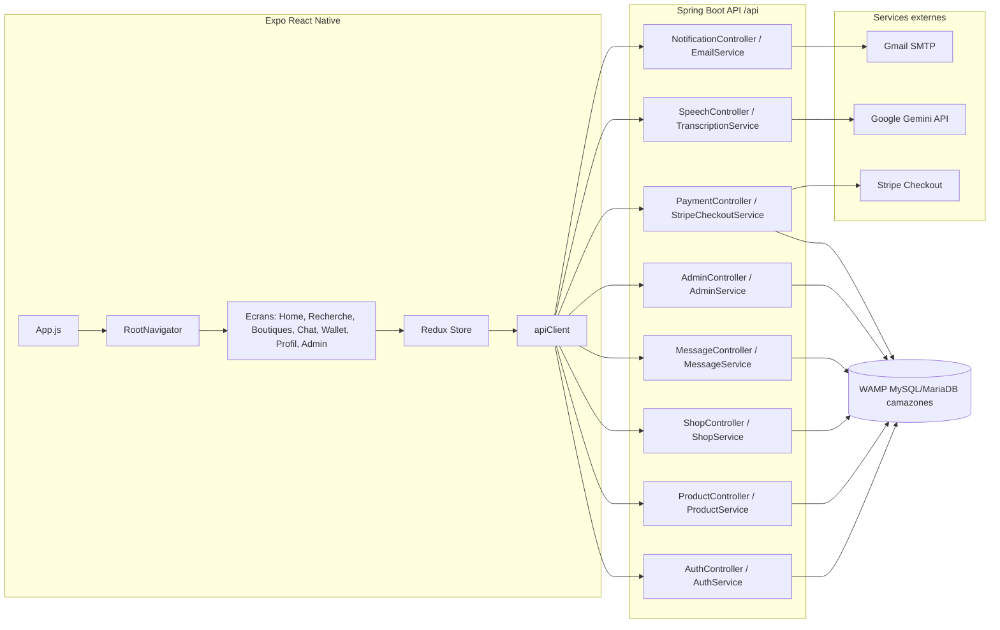
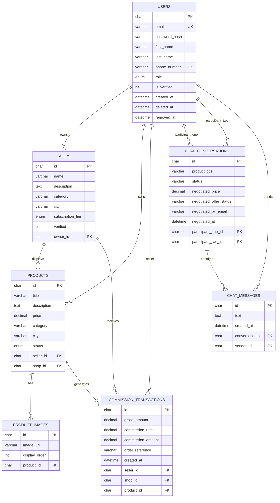
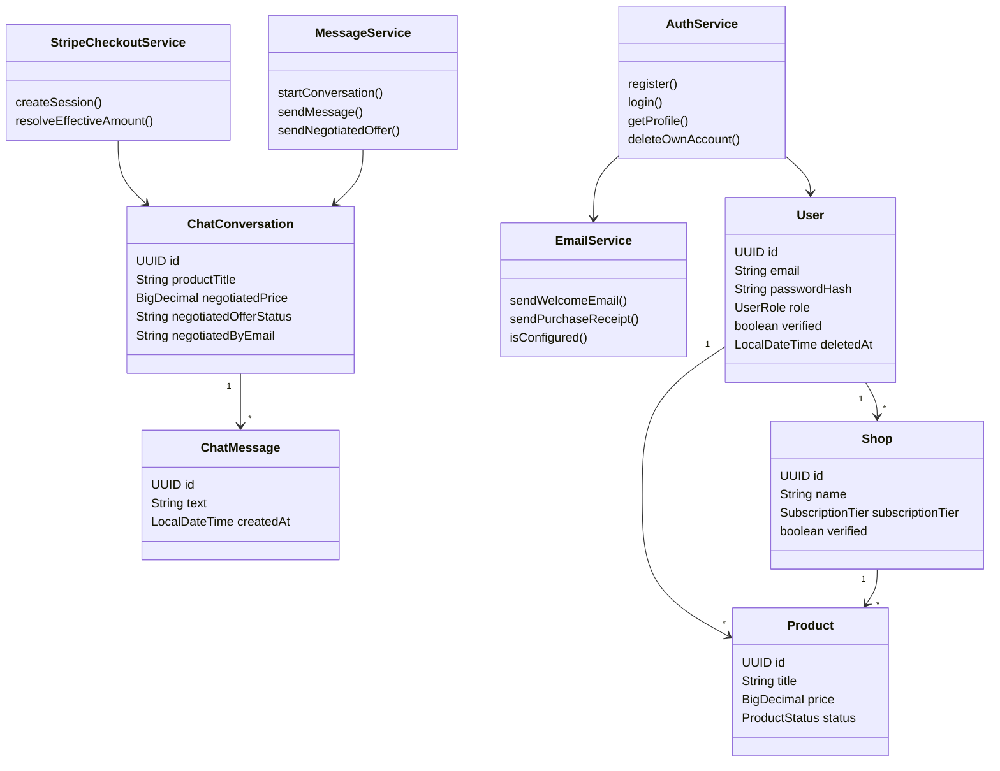
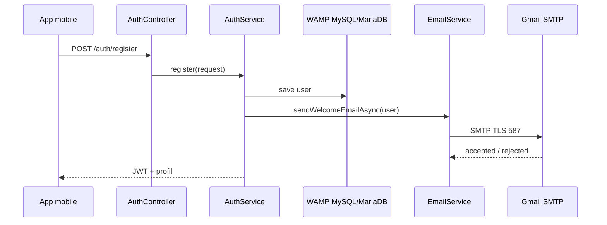
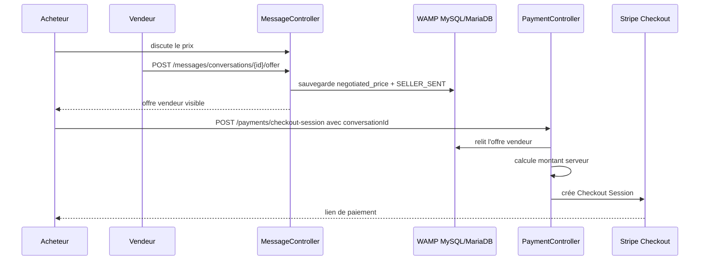
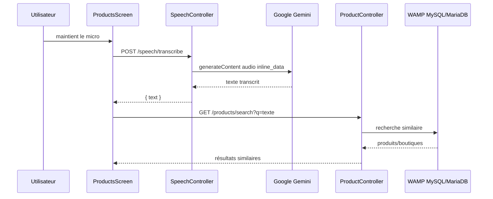

# Diagrammes UML Camazones

## Architecture

```mermaid
flowchart LR
  subgraph Mobile["Expo React Native"]
    App["App.js"]
    Root["RootNavigator"]
    Store["Redux Store"]
    Screens["Ecrans: Home, Recherche, Boutiques, Chat, Wallet, Profil, Admin"]
    ApiClient["apiClient"]
  end

  subgraph Backend["Spring Boot API /api"]
    Auth["AuthController / AuthService"]
    Products["ProductController / ProductService"]
    Shops["ShopController / ShopService"]
    Messages["MessageController / MessageService"]
    Payments["PaymentController / StripeCheckoutService"]
    Speech["SpeechController / TranscriptionService"]
    Mail["NotificationController / EmailService"]
    Admin["AdminController / AdminService"]
  end

  subgraph External["Services externes"]
    Gmail["Gmail SMTP"]
    Gemini["Google Gemini API"]
    Stripe["Stripe Checkout"]
  end

  DB[("WAMP MySQL/MariaDB camazones")]

  App --> Root --> Screens
  Screens --> Store
  Store --> ApiClient
  ApiClient --> Auth
  ApiClient --> Products
  ApiClient --> Shops
  ApiClient --> Messages
  ApiClient --> Payments
  ApiClient --> Speech
  ApiClient --> Mail
  ApiClient --> Admin
  Auth --> DB
  Products --> DB
  Shops --> DB
  Messages --> DB
  Admin --> DB
  Payments --> Stripe
  Payments --> DB
  Speech --> Gemini
  Mail --> Gmail
```

## Base de données

```mermaid
erDiagram
  USERS ||--o{ SHOPS : owns
  USERS ||--o{ PRODUCTS : sells
  SHOPS ||--o{ PRODUCTS : displays
  PRODUCTS ||--o{ PRODUCT_IMAGES : has
  PRODUCTS ||--o{ COMMISSION_TRANSACTIONS : generates
  SHOPS ||--o{ COMMISSION_TRANSACTIONS : receives
  USERS ||--o{ COMMISSION_TRANSACTIONS : seller
  USERS ||--o{ CHAT_CONVERSATIONS : participant_one
  USERS ||--o{ CHAT_CONVERSATIONS : participant_two
  CHAT_CONVERSATIONS ||--o{ CHAT_MESSAGES : contains
  USERS ||--o{ CHAT_MESSAGES : sends

  USERS {
    char id PK
    varchar email UK
    varchar password_hash
    varchar first_name
    varchar last_name
    varchar phone_number UK
    enum role
    bit is_verified
    datetime created_at
    datetime deleted_at
    datetime removed_at
  }

  SHOPS {
    char id PK
    varchar name
    text description
    varchar category
    varchar city
    enum subscription_tier
    bit verified
    char owner_id FK
  }

  PRODUCTS {
    char id PK
    varchar title
    text description
    decimal price
    varchar category
    varchar city
    enum status
    char seller_id FK
    char shop_id FK
  }

  PRODUCT_IMAGES {
    char id PK
    varchar image_url
    int display_order
    char product_id FK
  }

  CHAT_CONVERSATIONS {
    char id PK
    varchar product_title
    varchar status
    decimal negotiated_price
    varchar negotiated_offer_status
    varchar negotiated_by_email
    datetime negotiated_at
    char participant_one_id FK
    char participant_two_id FK
  }

  CHAT_MESSAGES {
    char id PK
    text text
    datetime created_at
    char conversation_id FK
    char sender_id FK
  }

  COMMISSION_TRANSACTIONS {
    char id PK
    decimal gross_amount
    decimal commission_rate
    decimal commission_amount
    varchar order_reference
    datetime created_at
    char seller_id FK
    char shop_id FK
    char product_id FK
  }
```

## Classes principales

```mermaid
classDiagram
  class User {
    UUID id
    String email
    String passwordHash
    UserRole role
    boolean verified
    LocalDateTime deletedAt
  }

  class Shop {
    UUID id
    String name
    SubscriptionTier subscriptionTier
    boolean verified
  }

  class Product {
    UUID id
    String title
    BigDecimal price
    ProductStatus status
  }

  class ChatConversation {
    UUID id
    String productTitle
    BigDecimal negotiatedPrice
    String negotiatedOfferStatus
    String negotiatedByEmail
  }

  class ChatMessage {
    UUID id
    String text
    LocalDateTime createdAt
  }

  class AuthService {
    register()
    login()
    getProfile()
    deleteOwnAccount()
  }

  class MessageService {
    startConversation()
    sendMessage()
    sendNegotiatedOffer()
  }

  class StripeCheckoutService {
    createSession()
    resolveEffectiveAmount()
  }

  class EmailService {
    sendWelcomeEmail()
    sendPurchaseReceipt()
    isConfigured()
  }

  User "1" --> "*" Shop
  User "1" --> "*" Product
  Shop "1" --> "*" Product
  ChatConversation "1" --> "*" ChatMessage
  MessageService --> ChatConversation
  StripeCheckoutService --> ChatConversation
  AuthService --> User
  AuthService --> EmailService
```

## Inscription et e-mail

```mermaid
sequenceDiagram
  participant Mobile as App mobile
  participant Auth as AuthController
  participant Service as AuthService
  participant DB as WAMP MySQL/MariaDB
  participant Mail as EmailService
  participant SMTP as Gmail SMTP

  Mobile->>Auth: POST /auth/register
  Auth->>Service: register(request)
  Service->>DB: save user
  Service->>Mail: sendWelcomeEmailAsync(user)
  Mail->>SMTP: SMTP TLS 587
  SMTP-->>Mail: accepted / rejected
  Service-->>Mobile: JWT + profil
```

## Prix négocié et paiement

```mermaid
sequenceDiagram
  participant Buyer as Acheteur
  participant Seller as Vendeur
  participant Msg as MessageController
  participant DB as WAMP MySQL/MariaDB
  participant Pay as PaymentController
  participant Stripe as Stripe Checkout

  Buyer->>Msg: discute le prix
  Seller->>Msg: POST /messages/conversations/{id}/offer
  Msg->>DB: sauvegarde negotiated_price + SELLER_SENT
  Msg-->>Buyer: offre vendeur visible
  Buyer->>Pay: POST /payments/checkout-session avec conversationId
  Pay->>DB: relit l'offre vendeur
  Pay->>Pay: calcule montant serveur
  Pay->>Stripe: crée Checkout Session
  Stripe-->>Buyer: lien de paiement
```

## Recherche vocale

```mermaid
sequenceDiagram
  participant User as Utilisateur
  participant App as ProductsScreen
  participant Speech as SpeechController
  participant Gemini as Google Gemini
  participant Products as ProductController
  participant DB as WAMP MySQL/MariaDB

  User->>App: maintient le micro
  App->>Speech: POST /speech/transcribe
  Speech->>Gemini: generateContent audio inline_data
  Gemini-->>Speech: texte transcrit
  Speech-->>App: { text }
  App->>Products: GET /products/search?q=texte
  Products->>DB: recherche similaire
  DB-->>Products: produits/boutiques
  Products-->>App: résultats similaires
```
